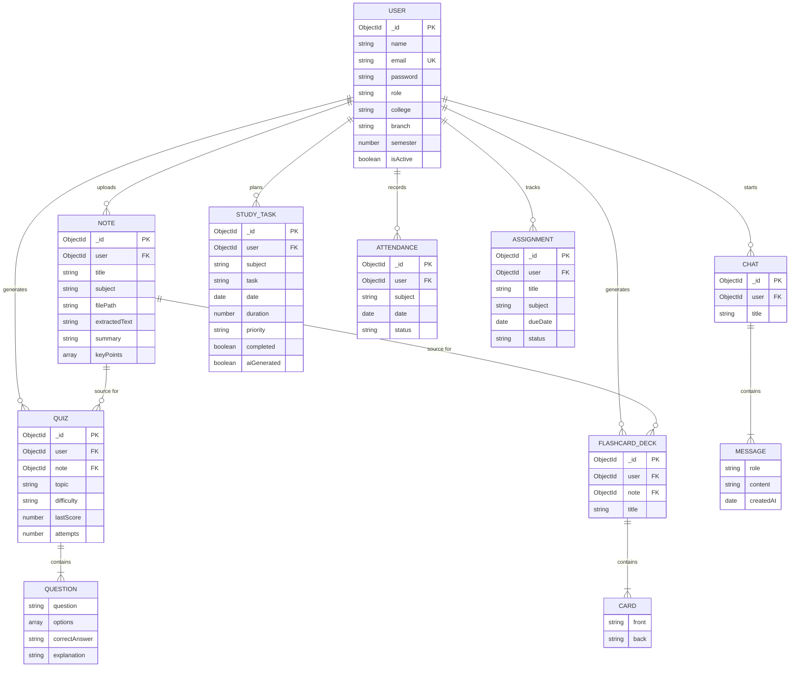

# 🔗 ER Diagram

Rendered with [Mermaid](https://mermaid.js.org/) — view on GitHub, GitLab, or
paste into https://mermaid.live to visualize.

### Notes on the diagram
- `MESSAGE`, `QUESTION`, and `CARD` are **embedded sub-documents** in MongoDB
  (not separate collections), shown here as related entities purely for
  conceptual clarity.
- `NOTE → QUIZ` / `NOTE → FLASHCARD_DECK` relationships are optional — a quiz
  or deck can instead be generated from a free-text topic with no note.
